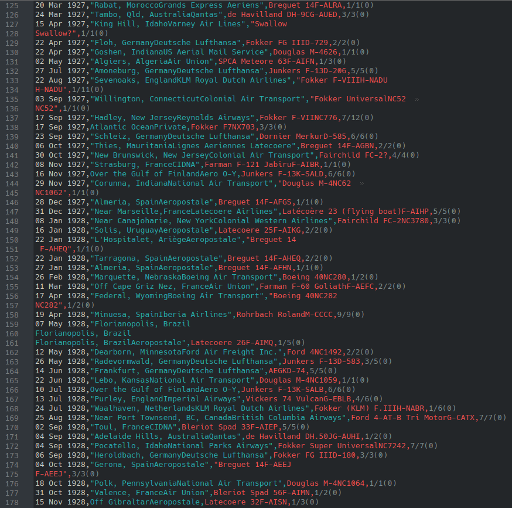
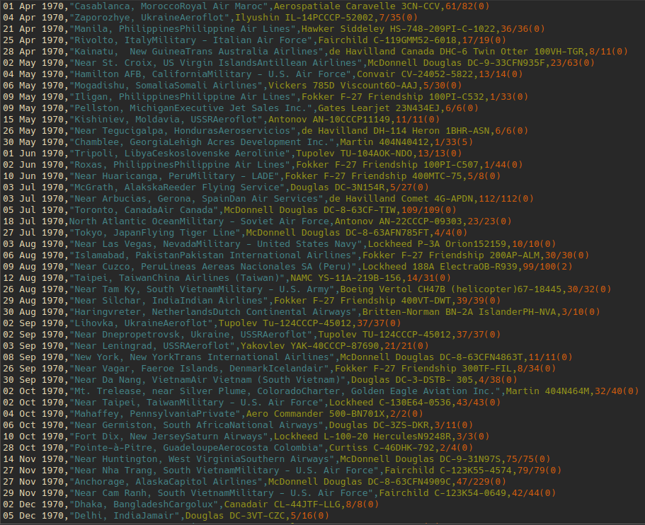
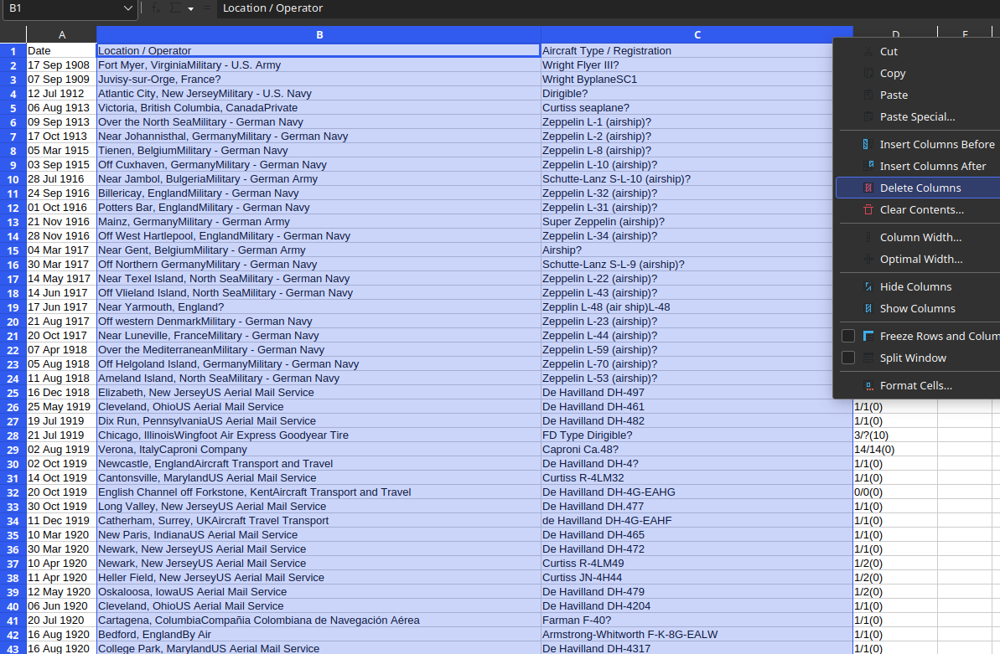
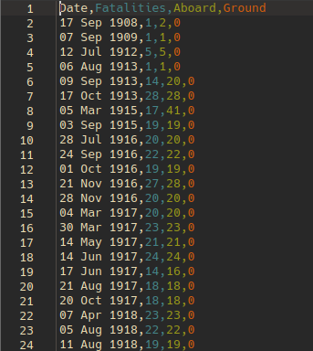
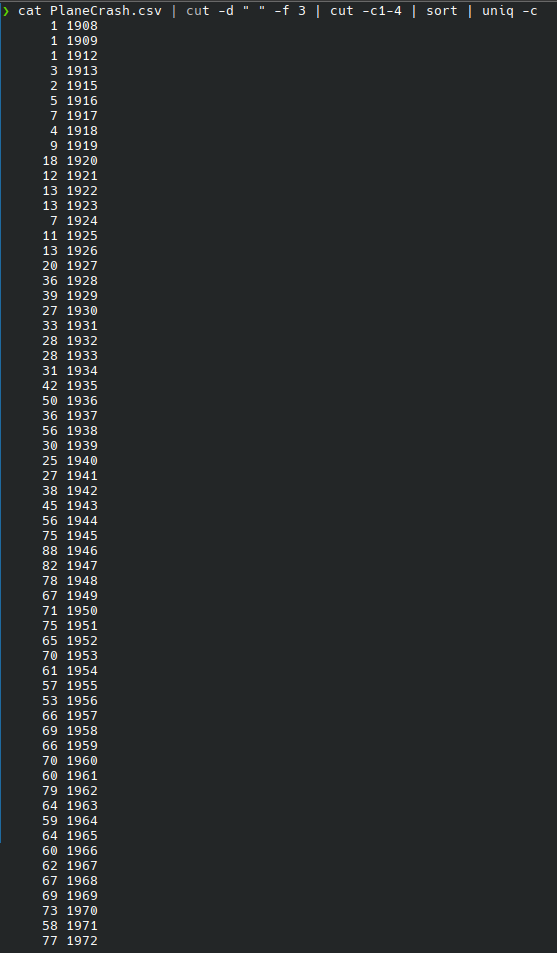
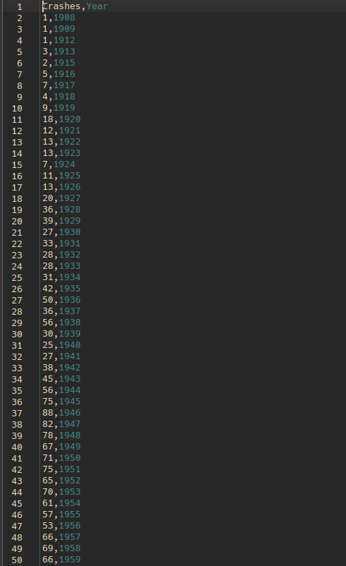
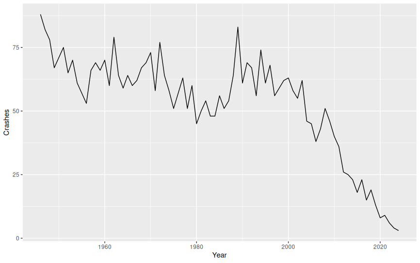
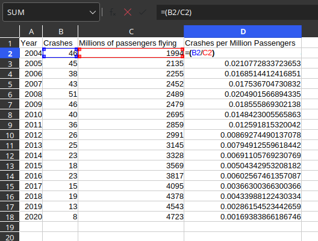
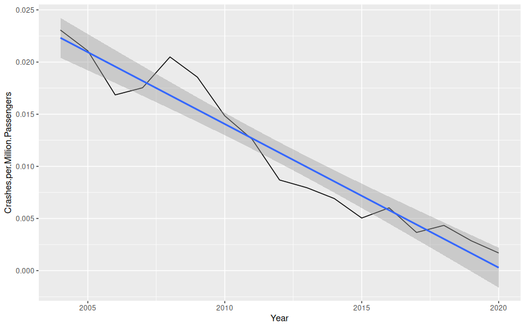

# Assignment 1 - Data processing & visualization walkthrough

1. Sign up for Kaggle
2. Grab the following dataset https://www.kaggle.com/datasets/aryan112345/all-plane-crashes-in-history
3. Realize that a lot of the data is poorly formatted and contains critical faults.

4. Clean it all up manually until everything is looking nice & clean

5. Use LibreOffice Calc (or Excel) to remove the columns with details about the crashed aircraft, partly due to irrelevance and partly due to how the data is damaged beyond repair.

6. Use find & replace with your favorite text editor to split the fatalities into separate columns



7. Pull open your favorite Posix terminal and count the number of crashes per year, pipe the results into a new file.



8. Convert the output into a CSV compatible format then swap the headers around in LibreOffice



9. Remove all crashes during & before WW2 as it pollutes the dataset.

10. Open up R Studio and create our first graph using the following code.

```
library(ggplot2)

data <- read.csv("PlaneCrash_per_year_after_ww2.csv", header = TRUE)

PlotA <- ggplot( data = data, aes(x = Year, y = Crashes)) + geom_line()
PlotA
```



11. Grab the second dataset from here https://www.statista.com/statistics/564717/airline-industry-passenger-traffic-globally/

12. Add the data as a new column in LibreOffice, then create a formula to calculate the number of crashes per million passengers each year.



13. Open up R Studio again and create the second graph using the following code.

```
library(ggplot2)

data <- read.csv("PlaneCrash_per_year_with_correlation.csv", header = TRUE)

PlotA <- ggplot( data = data, aes(x = Year, y = Crashes.per.Million.Passengers)) + geom_line() + geom_smooth(method = "lm")
PlotA
```


